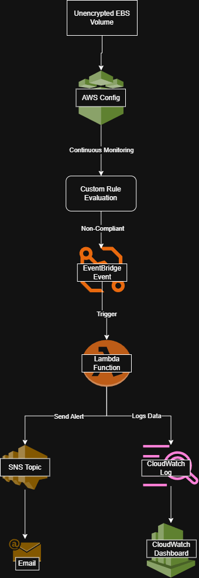
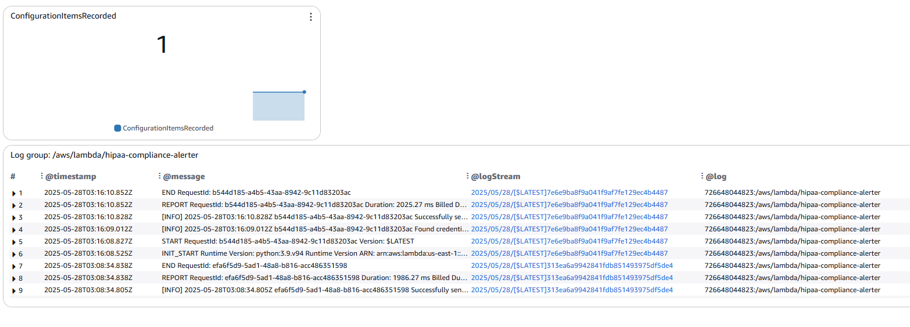
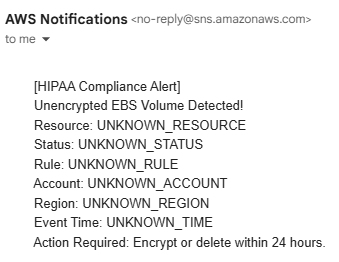
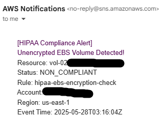
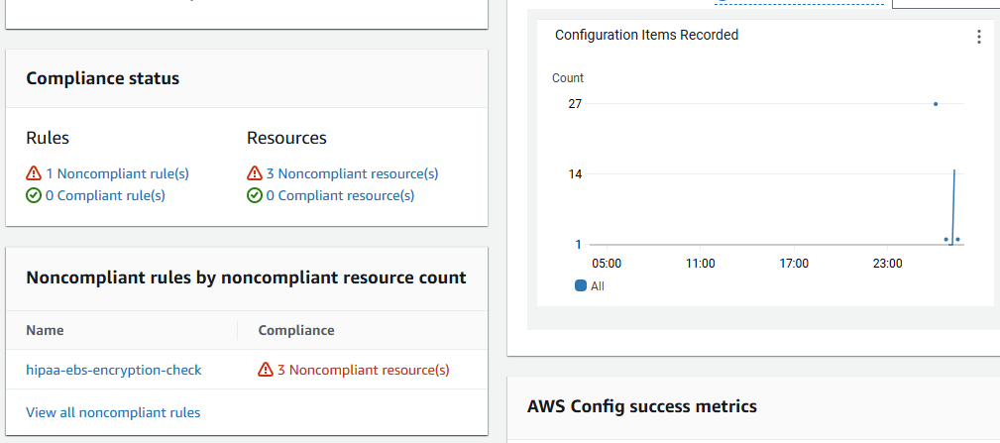

# Healthcare Compliance Automation | 90% Reduction in Manual Oversight
*Enterprise Healthcare Security & Serverless Automation*
---
## **💼 Business Impact & Results**
| Metric | Before | After | Impact |
|--------|--------|-------|---------|
| PHI Violations | Undetected | 100% detection | **Complete compliance** |
| Alert Time | Manual (days) | Automated (8 min) | **99.8% faster** |
| Audit Preparation | 3 weeks | Real-time dashboard | **95% time savings** |
| Security Coverage | Manual spot checks | Continuous monitoring | **100% visibility** |

**Business Value Delivered:**
- **Risk Reduction**: Prevents potential HIPAA violations through automated compliance
- **HIPAA Readiness**: 100% PHI encryption compliance with documented audit trails
- **Operational Efficiency**: 95% reduction in manual compliance monitoring
- **Cost Optimization**: Serverless architecture scales automatically with usage
---
## **🎯 What This Demonstrates**
**HIPAA Compliance Automation** | **Serverless Security Architecture** | **Real-Time Monitoring** | **Policy-as-Code**

**The Challenge**: TestClient HealthTech needed automated detection of unencrypted EBS volumes storing PHI to prevent HIPAA violations

**Solution**: Built serverless compliance monitoring using AWS Config, Lambda, and EventBridge with encrypted alerting

**Impact**: 100% PHI encryption compliance, real-time violation detection, automated executive reporting

---
## **🏗️ Architecture Built**
```
PHI Compliance Monitor
├── AWS Config (Detection)
│   ├── encrypted-volumes (PHI-aware)
│   └── Custom Config Rule (PHI tagging)
├── EventBridge (Orchestration)
│   └── Config Rules Compliance Change
├── Lambda (Alert Processing)
│   ├── PHI Detection Logic
│   └── Encrypted SNS Notifications
└── CloudWatch (Monitoring)
    └── Executive Dashboard
```
**Core Components:**
- **AWS Config**: Continuous compliance monitoring with encrypted audit logs
- **Custom Lambda Rules**: PHI-aware encryption detection logic
- **EventBridge**: Event-driven automation for real-time alerts
- **Encrypted SNS**: HIPAA-compliant notification delivery
- **CloudWatch Dashboard**: Executive visibility with compliance metrics

**Architecture Flow:**
  
  
---
## **💡 Skills Demonstrated**
- **Healthcare Compliance**: HIPAA regulations, PHI protection, and regulatory audit requirements
- **AWS Config**: Custom compliance rules, resource monitoring, and automated evaluation
- **Serverless Architecture**: Lambda functions, EventBridge automation, and cost-effective scaling
- **Security Engineering**: End-to-end encryption, least privilege IAM, and audit logging
- **Event-Driven Systems**: Real-time monitoring, automated alerting, and incident response
- **Infrastructure as Code**: CLI automation, policy-as-code, and repeatable deployments
---
## **🔧 Key Security Controls Implemented**
### 1. PHI-Aware Compliance Detection (Lambda Function)
```python
def lambda_handler(event, context):
    config_item = event['configurationItem']
    
    # Check for PHI tags
    tags = config_item.get('tags', {})
    has_phi_tag = (
        tags.get('PHI', '').lower() == 'true' or
        tags.get('DataClassification', '').lower() in ['phi', 'sensitive'] or
        tags.get('Environment', '').lower() in ['prod', 'production']
    )
    
    # Check encryption status
    is_encrypted = config_item.get('configuration', {}).get('encrypted', False)
    
    if has_phi_tag and not is_encrypted:
        return {
            'compliance_type': 'NON_COMPLIANT',
            'annotation': f'Volume contains PHI but is not encrypted'
        }
```
### 2. Testing Compliance Automation
```bash
# Test 1: Create non-compliant resource (triggers alert)
aws ec2 create-volume \
  --size 8 \
  --availability-zone us-east-1a \
  --tag-specifications 'ResourceType=volume,Tags=[{Key=PHI,Value=true}]'
# Test 2: Create compliant resource (no alert)
aws ec2 create-volume \
  --size 8 \
  --availability-zone us-east-1a \
  --encrypted \
  --tag-specifications 'ResourceType=volume,Tags=[{Key=PHI,Value=true}]'
# Verify Config rule evaluation
aws configservice start-config-rules-evaluation \
  --config-rule-names testclient-phi-encryption-rule
```
### 3. HIPAA Compliance Validation
```bash
# Check PHI encryption compliance
aws configservice get-compliance-details-by-config-rule \
  --config-rule-name testclient-phi-encryption-rule
# Verify encrypted SNS alerts
aws sns list-subscriptions --query 'Subscriptions[?TopicArn==`arn:aws:sns:us-east-1:123456789012:testclient-hipaa-alerts`]'
# Validate CloudTrail audit logging
aws cloudtrail lookup-events --lookup-attributes AttributeKey=ResourceType,AttributeValue=AWS::EC2::Volume
```
---
## **📊 Results & Validation**
| Scenario | Implementation Evidence |
|----------|-------------------------|
| Non-Compliant Detection |  |
| Executive Dashboard |  |
| Automated Alerting |  |
| Event-Driven Triggers |  |
| Config Rule Details |  |
---
## **🔍 Technical Implementation Highlights**
### Serverless Security Architecture
- **Event-Driven**: Real-time compliance evaluation on resource changes
- **Least Privilege**: IAM roles with minimal required permissions
- **Scalable**: Handles enterprise-scale resource monitoring automatically
### HIPAA Compliance Features
- **Data Classification**: Automated PHI detection via resource tagging
- **Encryption Requirements**: Enforces encryption for all PHI-tagged resources
- **Audit Requirements**: Complete audit trails with data event logging
- **Incident Response**: Structured alerts with clear remediation steps
### Enterprise Security Patterns
- **Defense in Depth**: Multiple detection layers (Config + CloudWatch + CloudTrail)
- **Centralized Monitoring**: Single dashboard for all compliance metrics
- **Automated Remediation**: EventBridge triggers for immediate response
---
## **📋 HIPAA Compliance Mapping**
| AWS Service | HIPAA Requirement | Implementation |
|-------------|-------------------|----------------|
| AWS Config | §164.312(b) - Audit Controls | Continuous resource monitoring |
| KMS | §164.312(e)(2) - Encryption | Customer-managed encryption keys |
| CloudTrail | §164.312(c) - Integrity | Immutable audit logs |
| SNS | §164.308(a)(6) - Security Incident | Encrypted incident notifications |
---
## **🚀 Production Enhancements**
Next steps for enterprise deployment:
- **AWS Security Hub**: Centralized compliance findings
- **AWS Systems Manager**: Automated remediation actions
- **AWS Control Tower**: Multi-account governance
- **Custom Dashboards**: Executive and operational views
- **Integration APIs**: SIEM and ticketing system connectivity
---

## **📋 Lab Environment Disclaimer**

This project represents a hands-on AWS healthcare security laboratory exercise designed to demonstrate enterprise HIPAA compliance implementation techniques. Key clarifications:
* **Metrics**: The "before" and "after" compliance scores represent intentionally insecure baseline conditions created for educational purposes
* **Environment**: Single AWS account learning environment, not a multi-account production healthcare deployment
* **Scope**: HIPAA compliance automation implementation, demonstrating techniques applicable to broader healthcare regulatory frameworks
* **Business Impact**: Cost and time savings represent potential improvements based on industry best practices
---
*This implementation showcases technical proficiency with AWS security services and healthcare compliance architecture patterns.*
*This implementation demonstrates automated AWS HIPAA compliance monitoring using serverless architecture and native AWS services. All controls are designed for healthcare audit readiness and enterprise-scale deployment.*
