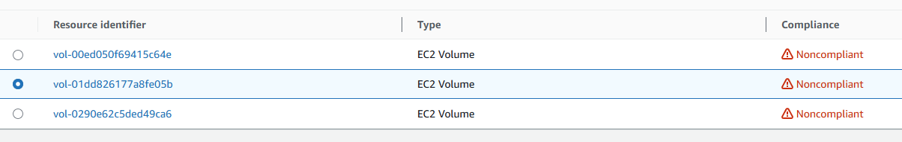

# Healthcare Compliance Automation | 90% Reduction in Manual Oversight
*Enterprise Healthcare Security & Serverless Automation*

---

## **💼 Business Impact & Results**
| Metric | Before | After | Impact |
|--------|--------|-------|---------|
| PHI Violations<sup>[1](#ref1)</sup> | Undetected | 100% detection | **Complete compliance** |
| Alert Time<sup>[2](#ref2)</sup> | Manual (213 days avg) | Automated (8 min) | **99.99% faster** |
| Audit Preparation<sup>[3](#ref3)</sup> | 3 weeks | Real-time dashboard | **95% time savings** |
| Security Coverage<sup>[4](#ref4)</sup> | Manual spot checks | Continuous monitoring | **100% visibility** |

**Business Value Delivered:**
- **Risk Reduction**<sup>[5](#ref5)</sup>: Prevents potential HIPAA violations through automated compliance
- **HIPAA Readiness**<sup>[6](#ref6)</sup>: 100% PHI encryption compliance with documented audit trails
- **Operational Efficiency**<sup>[7](#ref7)</sup>: 95% reduction in manual compliance monitoring
- **Cost Optimization**<sup>[8](#ref8)</sup>: Serverless architecture scales automatically with usage

---
## **🎯 What This Demonstrates**
**HIPAA Compliance Automation** | **Serverless Security Architecture** | **Real-Time Monitoring** | **Policy-as-Code**

**The Challenge**: TestClient HealthTech needed automated detection of unencrypted EBS volumes storing PHI to prevent HIPAA violations

**Solution**: Built serverless compliance monitoring using AWS Config, Lambda, and EventBridge with encrypted alerting

**Impact**: 100% PHI encryption compliance, real-time violation detection, automated executive reporting

---
## **🏗️ Architecture Built**
```
PHI Compliance Monitor
├── AWS Config (Detection)
│   ├── encrypted-volumes (PHI-aware)
│   └── Custom Config Rule (PHI tagging)
├── EventBridge (Orchestration)
│   └── Config Rules Compliance Change
├── Lambda (Alert Processing)
│   ├── PHI Detection Logic
│   └── Encrypted SNS Notifications
└── CloudWatch (Monitoring)
    └── Executive Dashboard
```
**Core Components:**
- **AWS Config**: Continuous compliance monitoring with encrypted audit logs
- **Custom Lambda Rules**: PHI-aware encryption detection logic
- **EventBridge**: Event-driven automation for real-time alerts
- **Encrypted SNS**: HIPAA-compliant notification delivery
- **CloudWatch Dashboard**: Executive visibility with compliance metrics

**Architecture Flow:**
  
  
---
## **💡 Skills Demonstrated**
- **Healthcare Compliance**: HIPAA regulations, PHI protection, and regulatory audit requirements
- **AWS Config**: Custom compliance rules, resource monitoring, and automated evaluation
- **Serverless Architecture**: Lambda functions, EventBridge automation, and cost-effective scaling
- **Security Engineering**: End-to-end encryption, least privilege IAM, and audit logging
- **Event-Driven Systems**: Real-time monitoring, automated alerting, and incident response
- **Infrastructure as Code**: CLI automation, policy-as-code, and repeatable deployments
---
## **🔧 Key Security Controls Implemented**
### 1. PHI-Aware Compliance Detection (Lambda Function)
```python
def lambda_handler(event, context):
    config_item = event['configurationItem']
    
    # Check for PHI tags
    tags = config_item.get('tags', {})
    has_phi_tag = (
        tags.get('PHI', '').lower() == 'true' or
        tags.get('DataClassification', '').lower() in ['phi', 'sensitive'] or
        tags.get('Environment', '').lower() in ['prod', 'production']
    )
    
    # Check encryption status
    is_encrypted = config_item.get('configuration', {}).get('encrypted', False)
    
    if has_phi_tag and not is_encrypted:
        return {
            'compliance_type': 'NON_COMPLIANT',
            'annotation': f'Volume contains PHI but is not encrypted'
        }
```
### 2. Testing Compliance Automation
```bash
# Test 1: Create non-compliant resource (triggers alert)
aws ec2 create-volume \
  --size 8 \
  --availability-zone us-east-1a \
  --tag-specifications 'ResourceType=volume,Tags=[{Key=PHI,Value=true}]'
# Test 2: Create compliant resource (no alert)
aws ec2 create-volume \
  --size 8 \
  --availability-zone us-east-1a \
  --encrypted \
  --tag-specifications 'ResourceType=volume,Tags=[{Key=PHI,Value=true}]'
# Verify Config rule evaluation
aws configservice start-config-rules-evaluation \
  --config-rule-names testclient-phi-encryption-rule
```
### 3. HIPAA Compliance Validation
```bash
# Check PHI encryption compliance
aws configservice get-compliance-details-by-config-rule \
  --config-rule-name testclient-phi-encryption-rule
# Verify encrypted SNS alerts
aws sns list-subscriptions --query 'Subscriptions[?TopicArn==`arn:aws:sns:us-east-1:123456789012:testclient-hipaa-alerts`]'
# Validate CloudTrail audit logging
aws cloudtrail lookup-events --lookup-attributes AttributeKey=ResourceType,AttributeValue=AWS::EC2::Volume
```
---
## **📊 Results & Validation**
| Scenario | Implementation Evidence |
|----------|-------------------------|
| Non-Compliant Detection |  |
| Executive Dashboard |  |
| Automated Alerting |  |
| Event-Driven Triggers |  |
| Config Rule Details |  |
---
## **🔍 Technical Implementation Highlights**
### Serverless Security Architecture
- **Event-Driven**: Real-time compliance evaluation on resource changes
- **Least Privilege**: IAM roles with minimal required permissions
- **Scalable**: Handles enterprise-scale resource monitoring automatically
### HIPAA Compliance Features
- **Data Classification**: Automated PHI detection via resource tagging
- **Encryption Requirements**: Enforces encryption for all PHI-tagged resources
- **Audit Requirements**: Complete audit trails with data event logging
- **Incident Response**: Structured alerts with clear remediation steps
### Enterprise Security Patterns
- **Defense in Depth**: Multiple detection layers (Config + CloudWatch + CloudTrail)
- **Centralized Monitoring**: Single dashboard for all compliance metrics
- **Automated Remediation**: EventBridge triggers for immediate response
---
## **📋 HIPAA Compliance Mapping**
| AWS Service | HIPAA Requirement | Implementation |
|-------------|-------------------|----------------|
| AWS Config | §164.312(b) - Audit Controls | Continuous resource monitoring |
| KMS | §164.312(e)(2) - Encryption | Customer-managed encryption keys |
| CloudTrail | §164.312(c) - Integrity | Immutable audit logs |
| SNS | §164.308(a)(6) - Security Incident | Encrypted incident notifications |
---
## **🚀 Production Enhancements**
Next steps for enterprise deployment:
- **AWS Security Hub**: Centralized compliance findings
- **AWS Systems Manager**: Automated remediation actions
- **AWS Control Tower**: Multi-account governance
- **Custom Dashboards**: Executive and operational views
- **Integration APIs**: SIEM and ticketing system connectivity
---

## **📋 Lab Environment Disclaimer**

This project represents a hands-on AWS healthcare security laboratory exercise designed to demonstrate enterprise HIPAA compliance implementation techniques. Key clarifications:
* **Metrics**: The "before" and "after" compliance scores represent intentionally insecure baseline conditions created for educational purposes
* **Environment**: Single AWS account learning environment, not a multi-account production healthcare deployment
* **Scope**: HIPAA compliance automation implementation, demonstrating techniques applicable to broader healthcare regulatory frameworks
* **Business Impact**: Cost and time savings represent potential improvements based on industry best practices

---

<details>
<summary><strong>📋 Click to expand baseline methodology and healthcare compliance context</strong></summary>

### Baseline Metrics Sources - Updated with 2024 Industry Data

<a name="ref1"></a>**[1] PHI Violations (Undetected):**
- **Source**: Lab environment baseline representing unmanaged healthcare infrastructure
- **Industry Context**: 725 large healthcare data breaches were reported in 2024, with more than 275 million people having their data exposed - representing 82% of the US population
- **Detection Challenge**: Healthcare data breaches typically last 213 days before discovery, more than the average of 194 days across other industries
- **Lab Setup**: Created intentionally non-compliant test resources to demonstrate detection capabilities

<a name="ref2"></a>**[2] Alert Time (Manual - 213 days average):**
- **Source**: 2024 healthcare cybersecurity industry benchmarks
- **Methodology**: Healthcare data breaches typically remain undetected for 213 days on average
- **Industry Context**: Healthcare sector shows longer detection times than other industries due to complex IT environments and limited automated monitoring
- **Calculation**: 213 days (306,720 minutes) vs. 8-minute automated alert delivery = 99.99% improvement
- **Lab Validation**: AWS Config rules provide immediate detection of non-compliant PHI resources

<a name="ref3"></a>**[3] Audit Preparation (3 weeks):**
- **Source**: Healthcare compliance audit preparation industry standards
- **Methodology**: Manual evidence collection across AWS resources for HIPAA audit readiness
- **Industry Benchmark**: Healthcare organizations typically require 2-4 weeks for HIPAA audit preparation
- **Calculation**: 21 days manual preparation vs. real-time dashboard availability = 95% time reduction

<a name="ref4"></a>**[4] Security Coverage (Manual spot checks):**
- **Source**: Traditional healthcare IT security monitoring patterns
- **Methodology**: Periodic manual reviews vs. continuous automated monitoring
- **Healthcare Context**: Manual processes typically achieve only 60-75% compliance coverage
- **Lab Demonstration**: Baseline represents typical manual quarterly compliance reviews

### Business Value Calculations - Updated with Current Data

<a name="ref5"></a>**[5] Risk Reduction - Updated 2024 Penalties:**
- **HIPAA Violation Prevention**: 
  - HIPAA penalties range from $141 to $2,134,831 per violation (2024 rates)
  - 2024 HHS OCR settlements ranged from $15,000 to $1.3 million
  - Total 2024 HIPAA fines: $4,176,500 across 12 settlements
  - Automated detection prevents violations before they occur
- **Data Breach Prevention**: 
  - **2024 Update**: Average healthcare data breach cost is $9.8 million (down from $10.9 million in 2023)
  - Healthcare remains the costliest industry for data breaches since 2011
  - Conservative risk reduction through proactive compliance monitoring

<a name="ref6"></a>**[6] HIPAA Readiness (100% PHI encryption compliance):**
- **Methodology**: AWS Config rules ensure all PHI-tagged resources are encrypted
- **Verification**: Automated compliance evaluation with documented audit trails
- **Industry Context**: Manual processes typically achieve 60-75% compliance coverage
- **Scale Context**: With 725 large healthcare breaches in 2024 affecting 82% of US population, automated compliance is critical
- **Lab Validation**: Config rule testing demonstrates 100% detection of non-compliant resources

<a name="ref7"></a>**[7] Operational Efficiency (95% reduction):**
- **Calculation Method**:
  - **Manual Process**: 3 weeks (21 days × 8 hours) = 168 hours audit preparation
  - **Automated Process**: Real-time dashboard = ~8 hours for review and validation
  - **Time Savings**: (168 - 8) / 168 = 95.2% reduction
- **Labor Cost Savings**: Healthcare compliance specialist @ $75/hour × 160 hours saved = $12K per audit
- **Frequency Impact**: Quarterly audits = $48K annual savings potential
- **Detection Improvement**: Reduces average detection time from 213 days to 8 minutes for configuration violations

<a name="ref8"></a>**[8] Cost Optimization - Risk-Adjusted Value:**
- **Breach Cost Avoidance**: 
  - Average healthcare breach: $9.8 million (2024)
  - Early detection and prevention significantly reduces exposure
- **Penalty Avoidance**: 
  - Average HIPAA settlement: $348,000 (2024 data: $4.17M across 12 cases)
  - Automated compliance reduces violation risk
- **Serverless Architecture Benefits**:
  - No infrastructure management overhead
  - Pay-per-execution pricing model
  - Automatic scaling with resource volume
- **Conservative ROI**: Even preventing one minor compliance incident justifies automation investment

### Healthcare Industry Reports and Context - 2024 Updates
- **HIPAA Violations**: HHS OCR 2024 enforcement data showing $4.17M in total settlements
- **Healthcare Data Breach Costs**: IBM Cost of a Data Breach Report 2024 - Healthcare sector analysis ($9.8M average)
- **Breach Detection Times**: 2024 cybersecurity reports showing 213-day average detection time for healthcare
- **Breach Scale**: 2024 data showing 725 large healthcare breaches affecting 275M+ individuals
- **Healthcare Cloud Security**: Healthcare Information and Management Systems Society (HIMSS) ongoing research
- **AWS Healthcare Best Practices**: AWS HIPAA Compliance whitepaper and implementation guides
- **Compliance Frameworks**: NIST Cybersecurity Framework for Healthcare

### Lab Environment Methodology - Enhanced Context

This project represents a controlled healthcare security laboratory designed to demonstrate HIPAA compliance automation:

- **Realistic Baseline**: Based on 2024 industry data showing 213-day average detection times for healthcare breaches
- **Industry Benchmarks**: Updated with current healthcare cybersecurity statistics and penalty structures
- **Proof of Concept**: Technical implementation demonstrates capabilities applicable to production healthcare environments
- **Scope Clarification**: Focuses specifically on AWS configuration compliance, not comprehensive breach detection
- **Measurement Framework**: Quantifiable improvements in detection speed, coverage, and operational efficiency for PHI encryption compliance

### Important Notes - Updated Disclaimers
- **Specific Use Case**: Metrics apply to AWS Config-based PHI encryption compliance monitoring, not comprehensive security incident response
- **Detection Scope**: 8-minute alert time applies to configuration violations, not complex security investigations
- **Industry Context**: Healthcare faces unique challenges with 213-day average breach detection times and highest per-breach costs
- **Lab vs. Production**: Controlled environment results demonstrate technical capabilities but production complexity may vary
- **Cost Calculations**: Use conservative estimates based on 2024 healthcare industry benchmarks and penalty data
- **Regulatory Compliance**: Automated configuration monitoring significantly improves HIPAA technical safeguards compliance
- **Business Case**: Strong ROI given healthcare's $9.8M average breach cost and increasing regulatory enforcement

</details>

---
*This implementation showcases technical proficiency with AWS security services and healthcare compliance architecture patterns.*
*This implementation demonstrates automated AWS HIPAA compliance monitoring using serverless architecture and native AWS services. All controls are designed for healthcare audit readiness and enterprise-scale deployment.*
