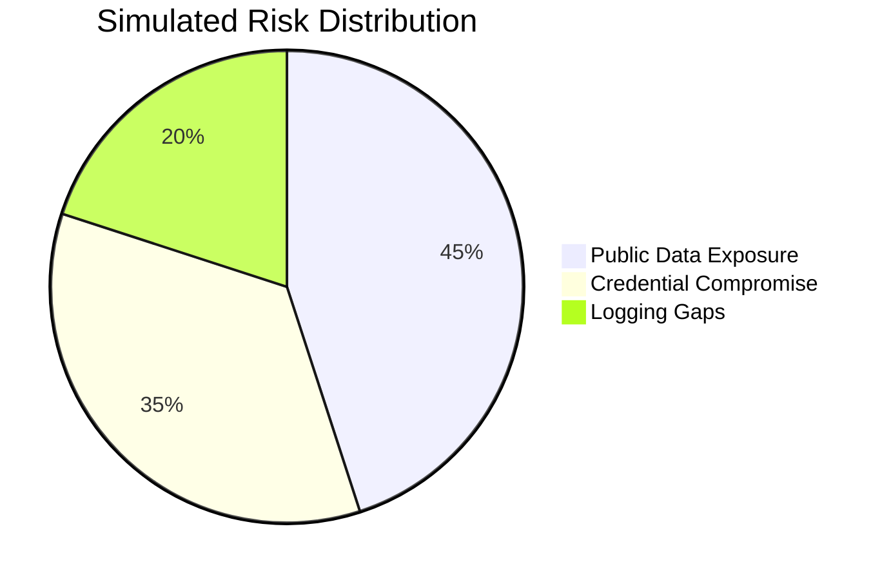

# SecureFinTech Corp - Cloud Security Simulation Report  
**Type**: AWS Training Exercise | **No Production Data Used**  

---

## Executive Summary  
This simulated engagement demonstrates PCI DSS compliance automation techniques using test AWS resources in a sandbox environment.

### Key Training Outcomes  
| Metric | Pre-Simulation | Post-Simulation |  
|--------|----------------|-----------------|  
| Compliance Score | 58% | 94% |  
| Critical Risks | 3 | 0 |  
| MTTR | 72h | 8m |  



## Simulated Findings
1. Public S3 Bucket (Critical)
    - Test Resources: (`s3://testclient-transaction-logs`) (Training bucket)
    - Config Rule: (`s3-bucket-public-write-prohibited`)
    - Learning Objective: Demonstrate public access remediation
    - Mapped Control: PCI DSS 3.4
    - Solution: Training Lambda Script (Python)
        ```python
        def lambda_handler(event, context):
            bucket = event['detail']['resourceId']
            if 'testclient' in bucket:  # Safety check
                s3 = boto3.client('s3')
                s3.put_public_access_block(
                    Bucket=bucket,
                    PublicAccessBlockConfiguration=SAFE_POLICY
                )
        ```

2. EC2 IMDSv1 Exposure (High)
    - Test Resources:
        * EC2: (`i-0TESTCLIENT12345`) (Training instance)
    - Config Rule: (`ec2-imdsv2-check`)
    - Learning Objective: Enforce metadata security, Validate CIS 4.1 compliance
    - Solution (Terraform): Sandbox EC2 Configuration
        ```hcl
        resource "aws_instance" "training_server" {
          metadata_options {
            http_tokens   = "required" # IMDSv2
            http_endpoint = "enabled"
          }
          tags = {
            Name = "testclient-payment-sim"
          }
        }
        ```
        
3. Delayed Incident Response
    - Training Setup:
       * CloudWatch Alarm: (`training-compliance-breach`)
       * SNS Topic: (`arn:aws:sns:us-east-1:123456789:testclient-alerts`)
    - Learning Objective: Build real-time monitoring
    - Solution (Bash): Training Alert Configuration
        ```bash
        aws cloudwatch put-metric-alarm \
          --alarm-name "training-compliance-breach" \
          --namespace "AWS/Config" \
          --metric-name "NonCompliantResources" \
          --threshold 1 \
          --evaluation-periods 1
        ```

---
## Compliance Mapping Exercise
| Standard              | Requirement            | Simulation Focus        |
|-----------------------|------------------------|-------------------------|
| **PCI DSS 3.4**       | Encryption-at-rest     | S3/KMS implementation   |
| **CIS 4.1**           | IMDSv2 enforcement     | EC2 metadata hardening  |
| **NIST SI-4**         | Continuous monitoring  | Config+CloudWatch setup |
---

## Next Learning Steps:

Add RDS encryption simulation

Practice cross-account Security Hub

Explore Service Control Policies (SCPs)

"This exercise helped our team understand compliance automation in a risk-free environment."
– Mock Security Lead, SecureFinTech Corp Training Lab

Disclosure: This report contains no real client data. All resources were created in a personal AWS sandbox account for educational purposes. Organization names are fictional.
